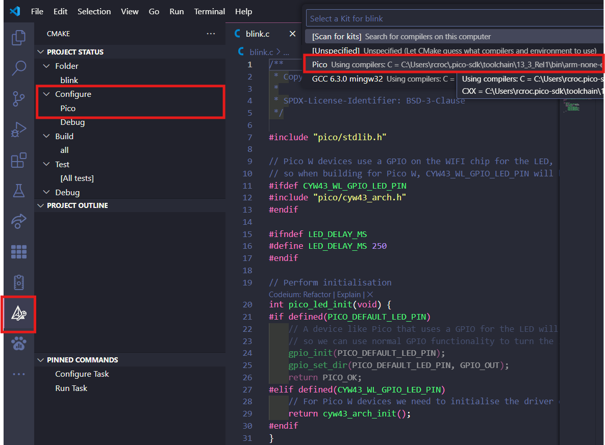
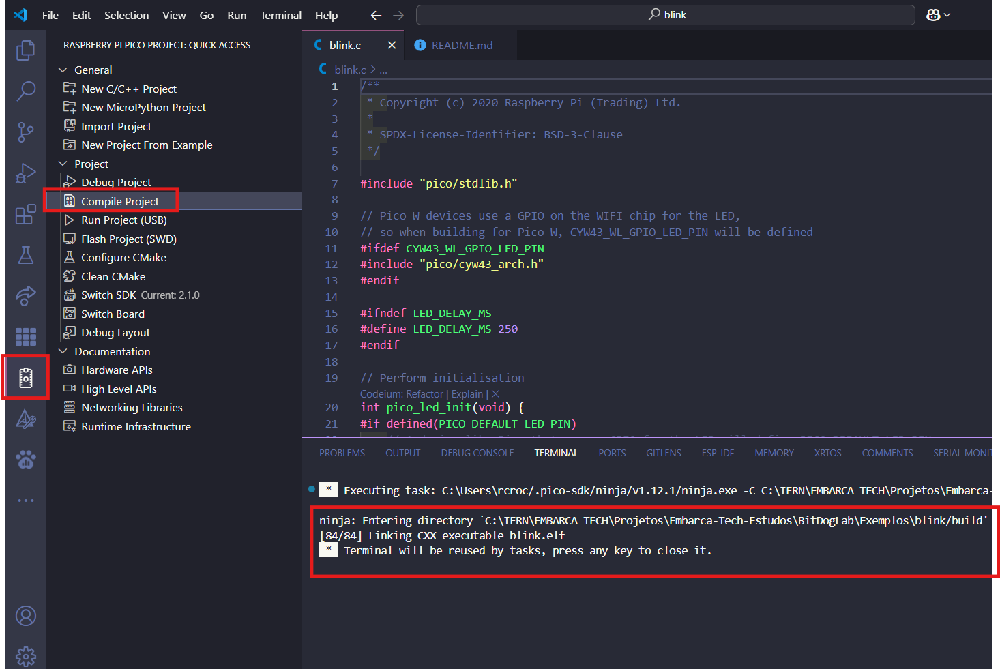
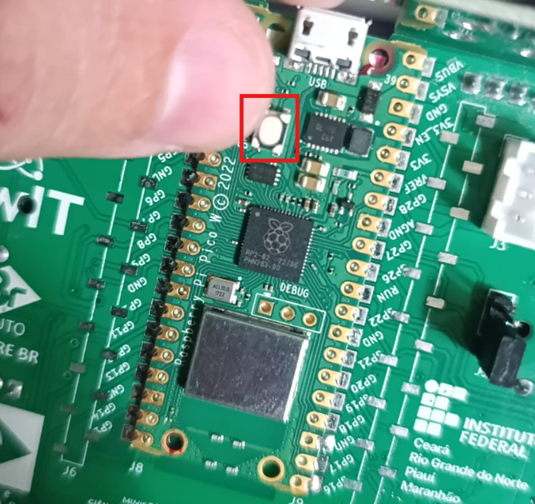
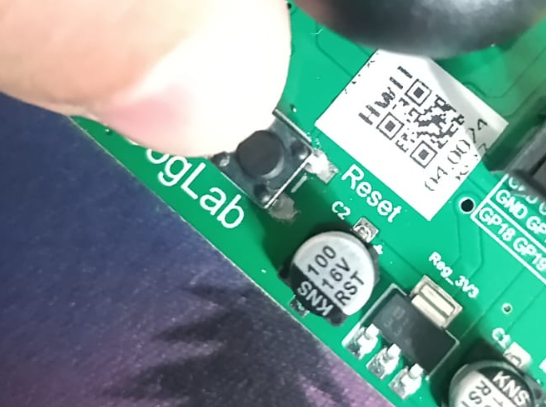
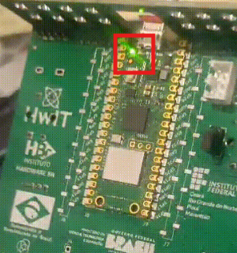

# Configurações do projeto

1. Ir na extensão CMake > Configure > Pico e selecionar a opção **Pico using compile**


2. Compilação do projeto: Clique na extenssão do **Raspbarry Pi Pico**
- Selecione **Compile Project**, feito isso, ira compilar seu projeto e sera mostrado no terminal, após a compilação clique em qualquer tecla no terinal para fechalo.


- Voltando em explore (file), varios arquivos foram criados na pasta **build**, usaremos o que tem extensão `.uf2`, nesse caso do projeto blink, `blink.uf2`

- com o botão direito do mouse, encima do do arquivo `blink.uf2`, selecione a opção: `Reveal in File Explore`.

- Agora no explorador de arquivos, iremos enviar o arquivo do nosso projeto para a placa **BitDogLab**.

- Ative o modo `BOOTSET` da placa para carregar e gravar o código. 

- - Na parte de trás da placa, encima do `Raspbarry`, tem um botão, paperte ele por 3 segundos, e logo em seguinda, na parte da frontal da placa, aperte e segure o botão `Reset`. Com os os botões precionados, aguarde um pouco e solte o botão `Reset` e depois o `Bootsel`.





- - Após isso, aparecera um dispositivo novo no seu computado/notebook, parecido com um PenDrive, essa é a placa `BitDogLab`.

- - Arraste o arquivo com extensão `.uf2` para a placa para copiar e gravar nela.

- - Feito isso, o LED do raspbarry ira piscar, mostrando que o código foi gravado na placa.



3. Para editar o código:
- Mude o valor da velocidade do LED em `#define LED_DELAY_MS 100` de 250 para 100

- Clique em `Compile Project` para compilar mais uma vez o código 

- Feito a complilação, repita novamente o passo de gravação do arquivo para à placa.
- - `blink.uf2` > `Reveal in File Explore`, `Modo Bootsel`, Copie o arquivo para a 

- - Seu LED ira piscar mais rápido agora.

---
## Código Blink - Moroni

blink.c

```c
#include "pico/stdlib.h"

#define LED_R_PIN 13
#define LED_G_PIN 11
#define LED_B_PIN 12

#define BTN_A_PIN 5

int A_state = 0;    //Botao A está pressionado?

/*
void set_leds(bool red, bool green, bool blue){
    gpio_put(LED_R_PIN, red);
    gpio_put(LED_G_PIN, green);
    gpio_put(LED_B_PIN, blue);
}*/


void SinalAberto(){
    gpio_put(LED_R_PIN, 0);
    gpio_put(LED_G_PIN, 1);
    gpio_put(LED_B_PIN, 0);   
}

void SinalAtencao(){
    gpio_put(LED_R_PIN, 1);
    gpio_put(LED_G_PIN, 1);
    gpio_put(LED_B_PIN, 0);
}

void SinalFechado(){
    gpio_put(LED_R_PIN, 1);
    gpio_put(LED_G_PIN, 0);
    gpio_put(LED_B_PIN, 0);
}

int WaitWithRead(int timeMS){
    for(int i = 0; i < timeMS; i = i+100){
        A_state = !gpio_get(BTN_A_PIN);
        if(A_state == 1){
            return 1;
        }
        sleep_ms(100);
    }
    return 0;
}
int main(){
    
    // INICIANDO LEDS
    gpio_init(LED_R_PIN);
    gpio_set_dir(LED_R_PIN, GPIO_OUT);
    gpio_init(LED_G_PIN);
    gpio_set_dir(LED_G_PIN, GPIO_OUT);
    gpio_init(LED_B_PIN);
    gpio_set_dir(LED_B_PIN, GPIO_OUT);

    // INICIANDO BOTÄO
    gpio_init(BTN_A_PIN);
    gpio_set_dir(BTN_A_PIN, GPIO_IN);
    gpio_pull_up(BTN_A_PIN);
    

    while(true){

        SinalAberto();
        A_state = WaitWithRead(8000);   //espera com leitura do botäo
        //sleep_ms(8000);


        if(A_state){               //ALGUEM APERTOU O BOTAO - SAI DO SEMAFORO NORMAL
            //SINAL AMARELO PARA OS CARROS POR 5s
            SinalAtencao();
            sleep_ms(5000);

            //SINAL VERMELHO PARA OS CARROS POR 10s
            SinalFechado();
            sleep_ms(10000);

        }else{                          //NINGUEM APERTOU O BOTAO - CONTINUA NO SEMAFORO NORMAL
                                      
            SinalAtencao();
            sleep_ms(2000);

            //SINAL VERMELHO PARA OS CARROS POR 15s
            SinalFechado();
            sleep_ms(8000);
        }
                
    }

    return 0;

}

```

CMakeList.txt
```c
# Generated Cmake Pico project file

cmake_minimum_required(VERSION 3.13)

set(CMAKE_C_STANDARD 11)
set(CMAKE_CXX_STANDARD 17)
set(CMAKE_EXPORT_COMPILE_COMMANDS ON)

# Initialise pico_sdk from installed location
# (note this can come from environment, CMake cache etc)

# == DO NOT EDIT THE FOLLOWING LINES for the Raspberry Pi Pico VS Code Extension to work ==
if(WIN32)
    set(USERHOME $ENV{USERPROFILE})
else()
    set(USERHOME $ENV{HOME})
endif()
set(sdkVersion 2.1.0)
set(toolchainVersion 13_3_Rel1)
set(picotoolVersion 2.1.0)
set(picoVscode ${USERHOME}/.pico-sdk/cmake/pico-vscode.cmake)
if (EXISTS ${picoVscode})
    include(${picoVscode})
endif()
# ====================================================================================
set(PICO_BOARD pico_w CACHE STRING "Board type")

# Pull in Raspberry Pi Pico SDK (must be before project)
include(pico_sdk_import.cmake)

project(Controle_Semaforo2 C CXX ASM)

# Initialise the Raspberry Pi Pico SDK
pico_sdk_init()

# Add executable. Default name is the project name, version 0.1

add_executable(Controle_Semaforo2 Controle_Semaforo2.c )

pico_set_program_name(Controle_Semaforo2 "Controle_Semaforo2")
pico_set_program_version(Controle_Semaforo2 "0.1")

# Generate PIO header
pico_generate_pio_header(Controle_Semaforo2 ${CMAKE_CURRENT_LIST_DIR}/blink.pio)

# Modify the below lines to enable/disable output over UART/USB
pico_enable_stdio_uart(Controle_Semaforo2 0)
pico_enable_stdio_usb(Controle_Semaforo2 0)

# Add the standard library to the build
target_link_libraries(Controle_Semaforo2
        pico_stdlib)

# Add the standard include files to the build
target_include_directories(Controle_Semaforo2 PRIVATE
  ${CMAKE_CURRENT_LIST_DIR}
)

# Add any user requested libraries
target_link_libraries(Controle_Semaforo2 
        hardware_pio
        
        )

pico_add_extra_outputs(Controle_Semaforo2)
```
