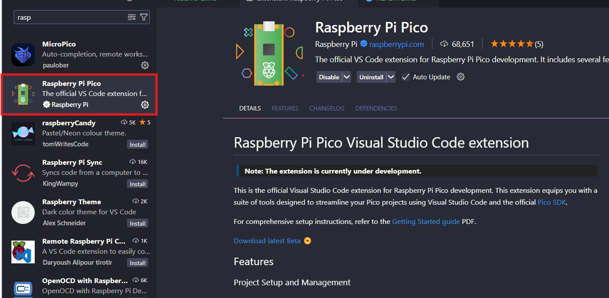
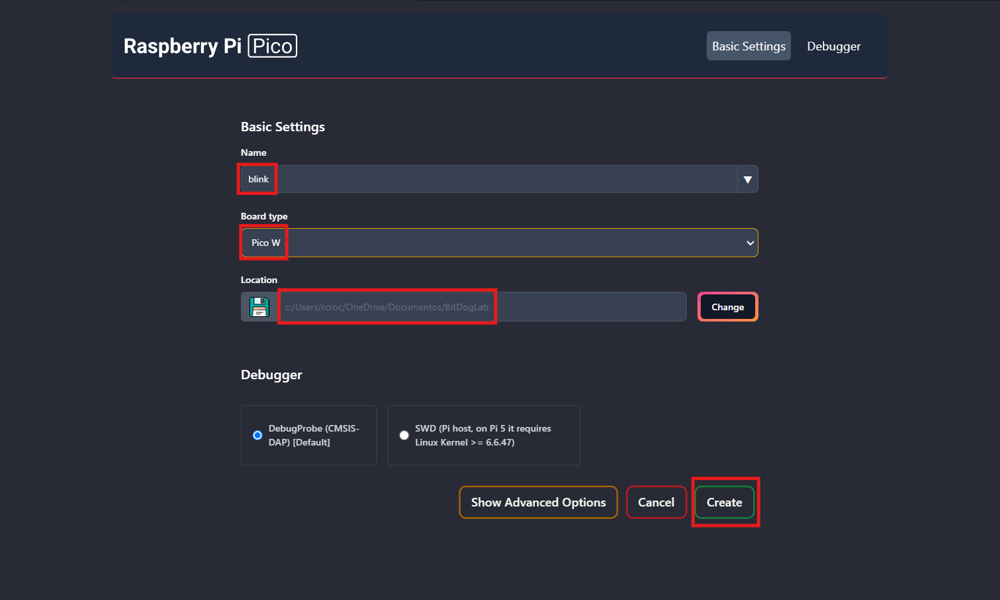

# Guia de Configuração da Placa BitDogLab

Bem-vindo ao guia de configuração da placa **BitDogLab**! Este documento orientará você no processo de instalação e configuração inicial da sua placa. Neste tutorial, você aprenderá a instalar o ambiente de programação para a placa **BitDogLab** usando o BitDogLab SDK no Visual Studio Code. Este guia assume que você já possui o C/C++ instalado e está utilizando o sistema operacional Windows.

## Índice

1. [Visão Geral](#visão-geral)
1. [Requisitos](#requisitos)
1. [Instalar o Visual Studio Code](#instalar-o-visual-studio-code)
2. [Instalar o Compilador ARM](#instalar-o-compilador-arm)
3. [Baixar o BitDogLab SDK](#baixar-o-bitdoglab-sdk)
4. [Configurar Variáveis de Ambiente](#configurar-variáveis-de-ambiente)
5. [Instalação e Configuração das Extensões CMake e CMakeTools](#instalação-e-configuração-das-extensões-cmake-e-cmaketools)
6. [Instalar o Driver BitDogLab](#instalar-o-driver-bitdoglab)
7. [Testando Exemplos](#testando-exemplos)
8. [Modo de Carregamento](#modo-de-carregamento)
9. [Carregar o Projeto](#carregar-o-projeto)

## Visão Geral

A **BitDogLab** é uma placa de desenvolvimento versátil ideal para projetos de IoT, robótica e aprendizado de eletrônica. Com suporte para diversos sensores e atuadores, é uma ferramenta poderosa para entusiastas e profissionais.

## Requisitos

- Placa BitDogLab
- Cabo USB para conexão com o computador
- Drivers de dispositivo (geralmente instalados automaticamente)
- Visual Studio Code 
- Extensão: Raspbarry Pi Pico

## Instalar o Visual Studio Code

1. Baixe o Visual Studio Code no [site oficial](https://code.visualstudio.com/).
2. Siga o assistente de instalação para sua plataforma (Windows, macOS ou Linux).

## Instalar o Compilador ARM

1. Baixe o compilador ARM no formato .exe (executável) através do link: [Arm GNU Toolchain Downloads](https://developer.arm.com/downloads/-/arm-gnu-toolchain-downloads).
2. Durante a instalação, certifique-se de marcar a opção para adicionar as variáveis de ambiente **(Add Path to Environment Variable)**.

## Baixar o Pico SDK

1. Acesse o repositório no GitHub: [Pico SDK Releases](https://github.com/raspberrypi/pico-setup-windows/releases/tag/v1.5.1).
2. Clique na última versão disponível e baixe o instalador no formato .exe.
3. Execute o instalador como administrador e anote o local de instalação.
4. Escolha uma pasta de fácil acesso para armazenar exemplos de código.

## Configurar Variáveis de Ambiente

1. Pressione `Windows` e digite `variáveis`. Vá para a aba `Propiedade do sistema` e clique em `Variáveis de Ambiente`.
2. Nas variáveis de usuário, clique em **Novo** e adicione:
   - **Nome da variável:** `PICO_SDK_PATH`
   - **Valor da variável:** O diretório onde você instalou o SDK (Exemplo: `C:\Program Files\Raspberry Pi\Pico SDK v1.5.1`).
3. Faça o mesmo nas variáveis do sistema, caso a variável `PICO_TOOLCHAIN_PATH` não esteja listada.
(Exemplo: `\Program Files\Raspberry Pi\Pico SDK v1.5.1\pico-sdk`).

## Instalação e Configuração das Extensões CMake e CMakeTools

1. Abra o VS Code e vá até o ícone de extensões.
2. Instale as extensões **Raspbarry Pi Pico**, **CMake** e **CMakeTools**.
3. Configure o CMakeTools:
   - Clique na engrenagem do plug-in e selecione `Settings`.
   - Verifique se o `CMake Path` está definido como `cmake`.
   - Adicione `PICO_SDK_PATH` no `CMake: Configure Environment` com o diretório de instalação do SDK.
4. Busque por `generator` e selecione `NMake Makefiles`.

## Instalar o Zadig, Driver RP2040 para embarcar diretamente pelo VScode

1. Baixe o instalador do driver necessário para a Raspberry através do link: [Zadig](https://zadig.akeo.ie/).
2. Execute o instalador como administrador e siga as instruções na tela.

## Testando Exemplos

1. Abra o VS Code e selecione o ícone da extensão Raspberry que aparece à esquerda.
2. Clique em "New Project From Exampless".
3. Selecione o exemplo que deseja testar (como `blink`), em "boardtype" escolha a placa `Pico W` e escolha o diretório onde deseja armazenar o projeto.
4. Clique em `Create`. Um novo arquivo com o código do exemplo será aberto.

**Como é a primeira vez que está criando um projet, o processo será mais demorado, entre 5 à 10min. Isso se dá devido a extensão está instalando todas ferramentas que fazem parte estarem sendo instaladas.** 

**Após a instalação, será aberta uma nova instancia do VSCode com o projeto** 

5. Na parte inferior da tela, clique no botão `Compilar`. Um arquivo `.uf2` será gerado na pasta selecionada.

**Você poderá embarcar o código, mas antes vamos aprender a deixar o nosso pi pico W no modo bootsel.**

## Modo de Carregamento

1. Conecte a placa BitDogLab via USB. Se um novo dispositivo aparecer, ela já está em modo de carregamento (BOOTSEL).
2. Para colocar a placa no modo de BOOTSEL, mantenha pressionado o botão de BOOTSEL por 3 segundos.
3. Em seguida, pressione o botão de reset e solte ambos os botões.
4. Quando um novo dispositivo aparecer no seu computador como um pendrive, você está pronto para carregar novos códigos.
5. Sempre que precisar embarcar um novo código é necessário entrar no modo bootsel.

## Carregar o Projeto

1. No VS Code, clique no ícone da extensão **Raspbarry** e selecione `Run Project (USB)`.
2. Parabéns! Você embarcou seu primeiro projeto na placa BitDogLab!

